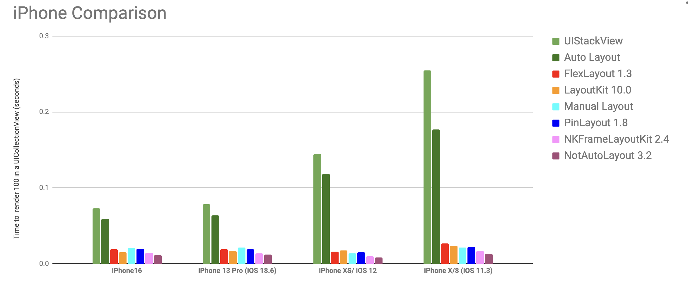

  

<h1 align="center" style="color: #376C9D; font-family: Arial Black, Gadget, sans-serif; font-size: 2em">Layout Framework Benchmark</h1>
 

  
  
  

 

Benchmark the performances of various Swift layout frameworks.

### Requirements
* iOS 8.0+
* Xcode 8.0+
* Swift 3.0+

# History 
This project is a spin-off of the excellent [LayoutKit benchmark](https://github.com/linkedin/LayoutKit). The benchmark has been extracted to add other iOS layout frameworks and to compare them.

 

# Why?
Choosing the right layout framework for your project is an important decision. The frameworks API is quite important, but its performance is also important. To help you with that decision, this benchmark compare different layout frameworks.

 

## Benchmark charts  

##### General comparison

This chart display a general comparison between device performance using each layout frameworks.
It displays the performance when layouting UICollectionView cells. This graph shows performance when layouting 100 UICollectionView cells.

The **Y axis** indicates the **number of seconds** to render all cells.

 

# Layout frameworks  

**The benchmark currently includes the following layout frameworks:**  
(ordered alphabetically and use the framework GitHub's description):

* **Auto layout**  
Apple's auto layout constraints.  
[Auto layout benchmark's source code](https://github.com/layoutBox/LayoutFrameworkBenchmark/blob/master/LayoutFrameworkBenchmark/Benchmarks/AutoLayout/FeedItemAutoLayoutView.swift)

* [**FlexLayout**](https://github.com/layoutBox/FlexLayout)  
FlexLayout adds a nice Swift interface to the highly optimized [Yoga](https://github.com/facebook/yoga) flexbox implementation. Concise, intuitive & chainable syntax.  
[FlexLayout benchmark's source code](https://github.com/layoutBox/LayoutFrameworkBenchmark/blob/master/LayoutFrameworkBenchmark/Benchmarks/FlexLayout/FeedItemFlexLayoutView.swift)

* [**LayoutKit**](https://github.com/linkedin/LayoutKit)  
LayoutKit is a fast view layout library for iOS, macOS, and tvOS.   
[LayoutKit benchmark's source code](https://github.com/layoutBox/LayoutFrameworkBenchmark/tree/master/LayoutFrameworkBenchmark/Benchmarks/LayoutKit)

* **Manual layout**  
Layout is done by setting UIView's frame property directly. This implementation comes directly from the LayoutKit benchmark.
[Manual layout benchmark's source code](https://github.com/layoutBox/LayoutFrameworkBenchmark/blob/master/LayoutFrameworkBenchmark/Benchmarks/ManualLayout/FeedItemManualView.swift)

* [**NKFrameLayoutKit**](https://github.com/kennic/NKFrameLayoutKit)  
NKFrameLayoutKit is a fast and easy to use layout library  
[NKFrameLayoutKit benchmark's source code](https://github.com/layoutBox/LayoutFrameworkBenchmark/blob/master/LayoutFrameworkBenchmark/Benchmarks/NKFrameLayoutKit/NKFrameLayoutKitView.swift)

* [**NotAutoLayout**](https://github.com/el-hoshino/NotAutoLayout)  
Layout your views without Auto Layout constraints, in a much more swifty way.  
[NotAutoLayout benchmark's source code](https://github.com/layoutBox/LayoutFrameworkBenchmark/blob/master/LayoutFrameworkBenchmark/Benchmarks/NotAutoLayout/FeedItemNotAutoLayoutView.swift)

* [**PinLayout**](https://github.com/layoutBox/PinLayout)  
Fast Swift UIViews layouting without auto layout. No magic, pure code, full control and blazing fast. Concise syntax, intuitive, readable & chainable.  
[PinLayout benchmark's source code](https://github.com/layoutBox/LayoutFrameworkBenchmark/blob/master/LayoutFrameworkBenchmark/Benchmarks/PinLayout/FeedItemPinLayoutView.swift)

* [**Texture**](https://github.com/TextureGroup/Texture)  
Optimize your app by making user interfaces thread safe, which means that you will be able to shift all expensive views into background threads.  
[Texture benchmark's source code](https://github.com/wsu-nyt/LayoutFrameworkBenchmark/blob/master/LayoutFrameworkBenchmark/FeedItemTextureNode.swift)

* **UIStackViews**  
Apple's UIStackViews.  
[UIStackViews benchmark's source code](https://github.com/layoutBox/LayoutFrameworkBenchmark/blob/master/LayoutFrameworkBenchmark/Benchmarks/UIStackView/FeedItemUIStackView.swift)

* [**Yoga**](https://github.com/facebook/yoga)  
Yoga's performance hasn't been tested directly, but FlexLayout has. FlexLayout is a light Swift interface for Yoga. 

:pushpin: Anyone who would like to integrate any other layout frameworks to this GitHub project is welcome.

 

## Benchmark details
The benchmark layout UICollectionView cells in multiple pass, each pass contains more cells than the previous one. 

## Benchmark cell's layout
Here are the benchmark rendering results to compare visual results:
 
* [LayoutKit rendering result](docs_markdown/benchmark_result_LayoutKit.png)
* [Manual layout rendering result](docs_markdown/benchmark_result_ManualLayout.png)
* [NKFrameLayoutKit rendering result](docs_markdown/benchmark_result_NKFrameLayoutKit.png)
* [PinLayout rendering result](docs_markdown/benchmark_result_PinLayout.png)
* [Texture rendering result](docs_markdown/benchmark_result_Texture.png)

:pushpin: Some work would be required to adjust the layout so that they all match perfectly. 

 

## Benchmark data  
You can see the benchmark's data and charts in this **[Google Spreadsheet Document](https://docs.google.com/spreadsheets/d/1sUNdGWBM-d_W13yC7VcfkRXC3owCVsnIublnfW-4xn4/edit#gid=1032991425)**.

 

##### Details for different devices

The **X axis** in following charts indicates the **number of cells** contained for each pass. The **Y axis** indicates the **number of seconds** to render all cells from one pass.

 

 

 

 

 

 

## Project's TODO list

* Create a reference layout and update layout codes to match that reference.
* Display benchmark charts inside the app and being to able to export them.
* Export benchmark data to a spreadsheet.
* Add more layout frameworks.
* OSX support.
* tvOS support.
* ...

 

## Contributing, comments, ideas, suggestions, issues, .... 
For any **comments**, **ideas**, **suggestions**, simply open an [issue](https://github.com/layoutBox/LayoutFrameworkBenchmark/issues). 

If you'd like to contribute by adding other layout framework, you're welcomed!

 

## Adding another layout framework

The process is currently tedious...
 
* Add an implementation of the reference view.
* Run on all reference devices (or at least the two latest generation) in **Release mode**.
* Select the new layout from the Benchmark App.
* Update the XLSX document.
* Add a new chart
* Save the chart using "Save as Picture..."
* Update the README.md
* Create a pull request.

## License
BSD 3-Clause License 
